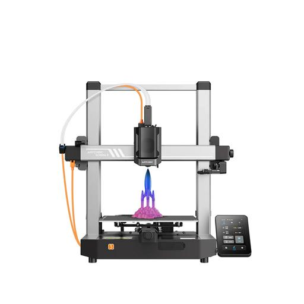
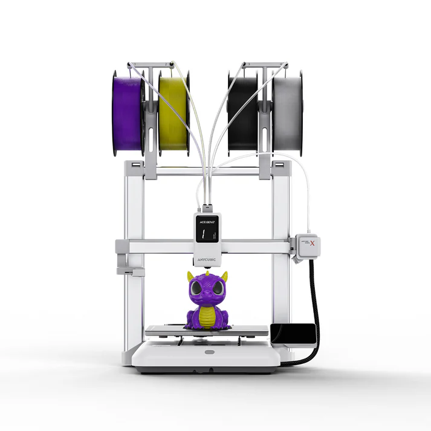

# Anycubic HA Integration

Home-Assistant-Integration fuer Anycubic-Cloud-Drucker mit Statussensoren, MQTT-Echtzeitupdates, Druck- und Dateifunktionen, ACE-/Materialverwaltung und optionaler Kameraansicht.

> 🗓️ **Aktuelles Release: 0.3.0-beta.14**
>
> - Ergaenzt gezielte Debug-Logs fuer das Anycubic-Kameralicht, um HA-Schalten und Slicer-Schalten faktenbasiert vergleichen zu koennen (`GET_LIGHT_STATUS`, `SET_LIGHT_STATUS`, MQTT-Light-Antworten und Fehler).
> - Baut das Frontend-Panel-Bundle neu, damit die im Anycubic-Cloud-Panel angezeigte Version wieder zur installierten Release-Version passt.
> - Bereinigt Kobra-X-MQTT-Protokolle: Fortschrittsupdates ohne Temperaturfelder werden verarbeitet, `aux_fan_speed_pct`/`z_comp` erzeugen keine Warnungen mehr, bekannte `video/initSuccess`- und `buried`-Reports werden ohne Fehlerrauschen konsumiert.
> - Testet das Anycubic-Kameralicht ohne Druckprojekt-Kontext (`project_id=0`) und initialisiert den Lichttyp vor dem Schalten per Statusabfrage, damit HA nicht erst durch einen vorherigen Slicer-Schaltvorgang angelernt werden muss.
> - Laedt lokale, USB- und Cloud-Dateilisten beim ersten Oeffnen des jeweiligen Dateitabs vorsichtig automatisch, wenn fuer den ausgewaehlten Drucker noch keine Liste geladen ist. Manuelles Aktualisieren bleibt fuer bewusstes Neuladen erhalten.
> - Ergaenzt eine native Home-Assistant-`light.*`-Entity fuer das Anycubic-Kameralicht bei Druckern mit Kamera-/Video- oder offizieller Lichtfunktion. Die Entity ist getrennt von der optionalen Dashboard-Card-`lightEntityId` und nutzt die Anycubic-Cloud-/MQTT-Lichtbefehle.
> - Ergaenzt GitHub-Release-Gates fuer Version-Sync, private lokale Daten und Tag-/Release-Kollisionen, damit Beta- und stabile Releases vor dem Veroeffentlichen gezielter geprueft werden koennen.
> - Stabilisiert das ACE-/Materialregal-Spulenlayout: vorhandene Spulen bleiben dynamisch, werden aber mit maximal vier gleichmaessigen Spalten pro Reihe angezeigt
> - Aktualisiert die Entity-Zuordnung im Frontend bei Home-Assistant-Updates erneut, damit ACE-, Materialregal- und Dateiansichten nicht erst nach einem spaeteren Refresh erscheinen
> - Zeigt beim Kobra-X-Materialregal vom ACE reservierte interne Slots als ACE-Zuleitung statt als normales Filament an
> - Entfernt Frontend-Fallbacks fuer alte deutsch erzeugte Entity-IDs, damit Integration, Panel und Card konsequent englische technische Entity-IDs verwenden
> - Kobra-X-Anzeige fuer internes Materialregal und ACE-Spulen erwartet die stabilen englischen Entity-IDs; bestehende deutsche Alt-Entity-IDs koennen ueber den Migrationsdienst umbenannt werden
> - Lokale und USB-Dateiansichten verwenden die stabilen englischen Dateilisten-/MQTT-Entities und leeren beim Ordnerwechsel sofort die alte Liste
> - README empfiehlt den passenden Anycubic-Card-Fork fuer diese Integration und erklaert den Unterschied zur urspruenglichen Dashboard-Card
> - Haelt die Print-Button-Entity-IDs `pause_print`, `resume_print` und `cancel_print` beim vom Dashboard-Plugin erwarteten Format
> - Neue Entitaeten erhalten stabile englische Entity-ID-Vorschlaege, damit lokalisierte Anzeigenamen keine technischen Entity-IDs mehr eindeutschen
> - Neuer manueller Service `migrate_entity_ids` mit sicherem Probelauf, um bestehende lokalisierte Entity-IDs optional auf card-kompatible englische IDs umzubenennen
> - Ordnet die Datei-Aktionsbuttons im lokalen/USB-Dateimanager sauber rechts an: Play steht direkt vor Loeschen
> - Lokale und USB-Dateien koennen im Panel vorsichtig zum Druck vorbereitet werden: Der Play-Button oeffnet zuerst eine Vorbereitungsansicht mit Abbrechen/Drucken und optionaler ACE-Slotnummernliste
> - Neue Services `print_file_local` und `print_file_udisk` starten vorhandene Dateien vom Druckerspeicher bzw. USB-Speicher ohne vorherigen Datei-Upload
> - Ersetzt das zurueckgezogene Release 0.1.9 und behebt dessen Dateilisten-Pfadfehler beim Coordinator-Update
> - USB- und lokale Dateilisten behalten Ordnerinformationen, zeigen Ordner als klickbare Eintraege und fragen Unterordner mit passendem Pfad an
> - Frontend-Panel-Bundle neu gebaut, damit die im Panel angezeigte Version zur Release-Version passt
> - Bereinigt bekannte MQTT-Dateilisten-Reports mit `list_mode`, damit `listLocal`/`listUdisk` keine unhandled-data-Fehler mehr protokollieren
> - Behebt einen Sensor-Setup-Fehler aus 0.1.6, durch den Home Assistant die Anycubic-Sensorplattform nicht laden konnte
> - Offline gemeldete Drucker werden nicht mehr parallel als verfuegbar/beschaeftigt angezeigt
> - Nebenansicht startet Kamerastreams nur noch manuell per Play und beendet sie bei Stop, Druckerwechsel oder Verlassen der Ansicht
> - Anycubic-Cloudstream per Agora/WebRTC ohne aggressives Session-Polling
> - Optionale Home-Assistant-`camera.*`-Entities pro Drucker fuer lokale Kameraquellen
> - Robustere Slicer-Next-Tokenverarbeitung und bereinigte MQTT-Startup-/S1-Reports
> - Optionale S1-/neuere-Firmware-Sensoren fuer AUX-Fan und Box-Fan werden erst angelegt, wenn der Drucker diese MQTT-Werte meldet
> - Verbesserte Kobra-X-Material-/ACE-Erkennung fuer bekannte 4-Farben-Setups
>
> Getestet mit **Home Assistant 2026.6.1**, freigegeben ab **Home Assistant 2025.10.0**.
> MQTT-Echtzeitupdates benoetigen **Slicer Next (Windows)** und dessen **Access-Token**.

➡️ Eigener Fork mit:
- Fehlerkorrekturen
- deutschen Texten
- MQTT-Erweiterungen
- verbessertem MQTT-Fallback bei Verbindungsproblemen

---

## 📚 Inhalt

- [🧵 Kompatible Drucker](#-kompatible-drucker)
- [⚙️ Funktionsweise](#-funktionsweise)
- [🎨 Frontend-Card](#-frontend-card)
- [🖼️ Galerie](#-galerie)
- [🧩 Features](#-features)
- [📷 Kamera / Nebenansicht](#-kamera--nebenansicht)
- [📦 Installation über HACS (empfohlen)](#-installation-über-hacs-empfohlen)
- [🖐️ Manuelle Installation](#-manuelle-installation)
- [⚠️ Sicherheit und Haftung](#️-sicherheit-und-haftung)
- [🔐 Token auslesen (Slicer Next)](#-token-auslesen-slicer-next)
- [🌐 Web-Login (ohne MQTT, nur Polling)](#-web-login-ohne-mqtt-nur-polling)
- [📥 Releases](#-releases)
- [🙌 Mitwirkende](#-mitwirkende)
- [📄 Lizenz](#-lizenz)
- [💬 Feedback / Probleme](#-feedback--probleme)
- [✅ Kompatibilität](#-kompatibilität)

---

## 🧵 Kompatible Drucker

### Getestet / rueckgemeldet

- ✅ Kobra 3 Combo
- ✅ Kobra X (Basisfunktionen; ACE-/Materialanzeige fuer bekannte 4-Farben-Setups verbessert; Kameralicht-Entity in Erprobung)
- ✅ Kobra S1 (Basisfunktionen rueckgemeldet; Kamera und Chamber-Light noch offen)
- ✅ Kobra 2, 2 Max, 2 Pro
- ✅ Photon Mono M5s (Basis)
- ✅ Anycubic M7 Pro (Basis)

### Zum Testen / Rueckmeldung gesucht

- 🧪 Weitere noch nicht bestaetigte Modelle

Wenn du ein noch nicht bestaetigtes Modell testest, bitte Rueckmeldung geben: Wird das Geraet angelegt, welche Entitaeten funktionieren, gibt es MQTT- oder Kamera-Auffaelligkeiten? Bitte keine Tokens, privaten IPs, Seriennummern oder persoenlichen Daten in Issues hochladen.

---

## ⚙️ Funktionsweise

- Cloud-Polling: alle **1 Minute**
- MQTT (Echtzeit): **mehrfach pro Sekunde**
- Erfordert **Slicer Next Token** für MQTT-Zugriff

---

## 🎨 Frontend-Card

Empfohlen fuer diese Integration ist der passende Anycubic-Card-Fork:

➡️ [ljschmitt/hass-anycubic_card](https://github.com/ljschmitt/hass-anycubic_card)

Die urspruengliche [Anycubic-Karte fuer Home Assistant](https://github.com/WaresWichall/hass-anycubic_card) ist eine separate Dashboard-/Lovelace-Card und wurde fuer die originale Anycubic-Integration gebaut. Dieser Fork bleibt naeher an den Entity-IDs und Zusatzfunktionen dieser Integration. Bitte fuer neue Setups bevorzugt den Fork verwenden, damit Dashboard-Card und Integration denselben Stand erwarten.

Die Integration selbst bringt weiterhin ein eigenes Home-Assistant-Panel mit. Die externe Card ist optional und muss separat in HACS als Dashboard-/Frontend-Card installiert werden.

### Entity-IDs und externe Karten

Home Assistant kann Entity-IDs aus lokalisierten Anzeigenamen erzeugen. Dadurch konnten auf deutsch eingestellten Systemen z. B. Entity-IDs mit deutschen Begriffen entstehen, waehrend externe Dashboard-Karten haeufig englische Standardnamen erwarten.

Ab Version **0.2.5** schlagen neue Anycubic-Entities stabile englische Entity-IDs vor. Entity-Anzeigenamen bleiben ebenfalls Englisch und orientieren sich an den vom Anycubic-/Dashboard-Card-Umfeld erwarteten Namen. Deutsche Uebersetzungen werden fuer Konfiguration, Services, Panel-/Card-UI und Dokumentation verwendet, aber nicht fuer Entity-Namen.

Ab Version **0.2.6** bleiben die Print-Button-Entity-IDs bewusst beim vom Dashboard-Plugin erwarteten Format `pause_print`, `resume_print` und `cancel_print`. Die Sensor-Kompatibilitaet bleibt davon unberuehrt.

Bestehende Entity-IDs werden bewusst **nicht automatisch** umbenannt, weil das vorhandene Dashboards, Automationen oder Skripte brechen koennte. Wer bestehende lokalisierte Entity-IDs auf die stabilen englischen Namen umstellen moechte, kann den Dienst `anycubic_ha_integration.migrate_entity_ids` verwenden:

1. In Home Assistant **Entwicklerwerkzeuge -> Dienste** oeffnen
2. Dienst `anycubic_ha_integration.migrate_entity_ids` auswaehlen
3. Zuerst mit `dry_run: true` ausfuehren und die geplanten Umbenennungen im Home-Assistant-Log pruefen
4. Nur wenn die geplanten Aenderungen passen, erneut mit `dry_run: false` ausfuehren
5. Danach eigene Dashboards, Karten, Automationen und Skripte pruefen

Der Dienst benennt nur Entity-Registry-Eintraege dieser Integration um. Er legt keine Kameras an, loescht keine Entities und veraendert keine persoenlichen Home-Assistant-Einstellungen ausser den bewusst migrierten Entity-IDs.

---

## 🖼️ Galerie



  
  
  
  


---

## 🧩 Features

- Mehrere Drucker gleichzeitig
- Druckstart / Pause / Fortsetzen / Abbruch (via Services & UI)
- Vorbereiteter Druckstart aus lokalen und USB-Dateilisten mit optionaler ACE-Slotnummernliste
- ACE-Slot-Verwaltung (Farbe, Presets, Services)
- Dateimanager (MQTT benötigt)
- Sensoren: Temp, Speed, Fan, Job-Fortschritt, Name, Zeit, …
- Firmware-Update-Entitäten
- MQTT-Aktivität automatisch während Druck (oder dauerhaft)
- Frontend-Panel mit Status, Nebenansicht + Dateimanager
- Native Kameralicht-Entity fuer Drucker, die das Anycubic-Kamera-/Lichtkommando unterstuetzen
- Spulen-Trocknung & Materialmanagement (ACE)
- Konfigurierbarer MQTT-Modus („nur beim Drucken“, dauerhaft, deaktiviert)

---

## 📷 Kamera / Nebenansicht

Die Nebenansicht bietet standardmaessig den Anycubic-Cloud-Kamerastream des ausgewaehlten Druckers an. Fuer normale Anycubic-Firmware muss dafuer nichts weiter eingerichtet werden.

Der Kamerastream wird bewusst **nicht automatisch im Hintergrund gestartet**. Erst wenn in der Nebenansicht der Play-Button gedrueckt wird, wird die lokale Kameraquelle bzw. die Anycubic-Cloud-Kamerasession angefragt. Beim Stoppen, Verlassen der Ansicht oder Wechsel auf einen anderen Drucker wird der Stream wieder beendet.

Bei Druckern mit alternativer Firmware oder lokaler Kamera-Bruecke, z. B. Rinkhals/Moonraker, kann optional pro Drucker eine Home-Assistant-`camera.*`-Entity verwendet werden. Das ueberschreibt nicht die Standardkamera fuer alle Drucker, sondern nur den jeweils gemappten Drucker.

Hinweis zum Anycubic-Cloudstream: Der verschluesselte WebRTC-Stream benoetigt im Browser einen sicheren Kontext, also z. B. HTTPS, Home Assistant Cloud oder localhost. Wenn Home Assistant nur ueber unverschluesseltes HTTP aufgerufen wird, kann der Browser die Kamera blockieren. Eine lokale Home-Assistant-`camera.*`-Entity wird dagegen ueber den Home-Assistant-Kameraproxy geladen und ist deshalb der sauberste Weg fuer lokale Streams.

### Kameralicht

Drucker, die das Anycubic-Kamera-/Lichtkommando unterstuetzen, erhalten eine native Home-Assistant-`light.*`-Entity, z. B. `light.anycubic_printer_camera_light`. Diese Entity schaltet das Kameralicht des Druckers ueber die Anycubic-Cloud-/MQTT-Befehle, so wie es auch im Slicer-Print-Setting angezeigt wird.

Diese native Entity ist nicht dasselbe wie die optionale `lightEntityId` in der externen Dashboard-Card. `lightEntityId` verweist auf eine beliebige vorhandene Home-Assistant-Lichtquelle, z. B. eine Raumlampe. Die native Kameralicht-Entity gehoert dagegen zum Anycubic-Drucker selbst.

Da Anycubic die Lichtfunktion nicht bei jedem Modell gleich in der Funktionsliste deklariert, wird die Entity bei Druckern mit Kamera-/Video-Funktion oder offizieller `VIDEO_LIGHT`-/`BOX_LIGHT`-Funktion angelegt. Wenn ein Drucker den Befehl nicht unterstuetzt oder offline ist, kann das Schalten fehlschlagen oder unverfuegbar bleiben.

### Integrierte Rinkhals/Moonraker-Webcam als HA-Kamera anlegen

Die integrierte Rinkhals-Webcam wird von Moonraker meist als MJPEG-Stream angeboten:

```text
Snapshot: http://<drucker-ip>:4409/webcam/?action=snapshot
Stream:   http://<drucker-ip>:4409/webcam/?action=stream
```

In Home Assistant:

1. **Einstellungen -> Geraete & Dienste -> Integration hinzufuegen**
2. **MJPEG IP Camera** suchen und auswaehlen
3. Als **MJPEG URL** die Stream-URL eintragen
4. Als **Still Image URL** die Snapshot-URL eintragen
5. Optional einen Namen vergeben, z. B. `Printer Webcam`
6. Nach dem Anlegen die Entity-ID pruefen, z. B. `camera.printer_webcam`

> Hinweis: Wenn beim Einrichten mit **Generic Camera** zwar der Snapshot angezeigt wird, der Stream aber nur laedt, ist das fuer diese Moonraker-URL normal. Die `/webcam/?action=stream`-Adresse ist ein MJPEG-HTTP-Stream und gehoert in Home Assistant zur **MJPEG IP Camera**-Integration. **Generic Camera** ist eher fuer Snapshot plus separate RTSP-/Streaming-Quelle geeignet.

> Wichtig: Nicht die Fluidd-Webcam-Ansicht oder eine go2rtc-Raumkamera-URL eintragen, wenn die integrierte Drucker-Webcam verwendet werden soll. Fuer Rinkhals ist die integrierte Kamera in der Regel der `/webcam/`-Pfad des Druckers.

### Kamera einem bestimmten Drucker zuordnen

Anschliessend wird die Kamera im Anycubic-Panel nur fuer diesen Drucker gemappt. Die Home-Assistant-Bereichs- oder Geraetezuordnung der Kamera reicht dafuer nicht aus; sie dient nur der Home-Assistant-Organisation.

Das Mapping gehoert in die **Panel-Kartenkonfiguration** der Anycubic-Integration:

1. **Einstellungen -> Geraete & Dienste -> Anycubic HA Integration**
2. Beim Integrationseintrag **Konfigurieren** auswaehlen
3. **Panel-Kartenkonfiguration** oeffnen
4. Falls dort `null` steht, den Inhalt durch die YAML-Konfiguration ersetzen

Die Drucker-ID fuer den Schluessel kann direkt aus der Anycubic-Panel-URL abgelesen werden. Wenn die URL z. B. so aussieht:

```text
/anycubic_ha_integration/<printer-panel-id>/main
```

dann ist `<printer-panel-id>` der Schluessel fuer `cameraEntityIds`.

Die Kamera-Entity-ID findest du in Home Assistant auf der Kamera-Entity, z. B. `camera.printer_webcam`.

```yaml
cameraEntityIds:
  "<printer-panel-id>": camera.printer_webcam
```

Der Schluessel kann ausserdem die Anycubic-Drucker-ID bzw. Seriennummer sein. Alternativ kann die Home-Assistant-Device-ID des Druckers verwendet werden.

Beispiel mit mehreren Druckern:

```yaml
cameraEntityIds:
  "<first-printer-panel-id>": camera.first_printer_webcam
  "<second-printer-panel-id>": camera.second_printer_webcam
```

Drucker ohne Eintrag in `cameraEntityIds` verwenden weiterhin automatisch den Anycubic-Cloud-Kamerastream.

Fuer einfache Setups mit nur einer Kamera kann weiterhin die bestehende Option `cameraEntityId` verwendet werden. `cameraEntityIds` hat Vorrang und ist fuer mehrere Drucker die empfohlene Variante.

---

## 📦 Installation über HACS (empfohlen)

1. **HACS → Integrationen → ⋯ → Custom Repositories**
2. Repository:  
   https://github.com/ljschmitt/hass-anycubic_cloud_v3  
   Kategorie: **Integration**
3. **Daten neu laden**
4. Integration in HACS suchen:  
   **Anycubic HA Integration**
5. Installieren → Home Assistant **neustarten**
6. **Einstellungen → Geräte & Dienste → Integration hinzufügen**

> ⚠️ Wähle als Auth-Methode: **Slicer Next (Windows)**  
> und füge den **Access-Token** ein (siehe unten).

---

## 🖐️ Manuelle Installation

1. Repository als ZIP herunterladen  
2. Entpacken nach:  
   /config/custom_components/anycubic_ha_integration/
3. Home Assistant neu starten
4. Integration hinzufügen wie oben

---

## ⚠️ Sicherheit und Haftung

Diese Integration steuert und liest 3D-Drucker ueber Anycubic Cloud, Services und optional MQTT. Die Nutzung erfolgt auf eigene Verantwortung.

Ich uebernehme keine Haftung fuer Schaeden am 3D-Drucker, an angeschlossenem Zubehoer, an Filament, Druckobjekten oder der Umgebung. Bitte alle Funktionen vorsichtig verwenden, neue Versionen gruendlich testen und insbesondere Steuerbefehle wie Druckstart, Pause, Abbruch, Temperatur-, ACE- und Materialslot-Aenderungen aufmerksam pruefen.

Fuer die Anycubic-MQTT-Verbindung sind die im Projekt enthaltenen Anycubic-TLS-Client-Zertifikatsdateien erforderlich. Sie gehoeren zur Anycubic-Protokollanbindung und enthalten keine benutzerspezifischen Home-Assistant- oder Anycubic-Zugangsdaten. Eigene Tokens, Logs, Screenshots mit Tokens oder lokale Konfigurationsdateien sollten niemals in Issues, Pull Requests oder Releases hochgeladen werden.

Fehler, Verbesserungsvorschlaege und Erfahrungen mit weiteren Druckermodellen koennen gerne ueber GitHub Issues gemeldet werden.

---

## 🔐 Token auslesen (Slicer Next)

1. **Slicer Next starten und eingeloggt lassen**
2. PowerShell-Befehl fuer Slicer Next 1.4.1.2+ (kopiert den neuesten Access-Token aus dem aktuellen Log in die Zwischenablage):
   ```powershell
   $log = Get-ChildItem "$env:AppData\AnycubicSlicerNext\log" -Filter "debug_*.log" | Sort-Object LastWriteTime -Descending | Select-Object -First 1
   $token = Select-String -Path $log.FullName -Pattern 'accessToken = ([^,\s]+)' | Select-Object -Last 1
   $token.Matches.Groups[1].Value | Set-Clipboard
   ```
3. Alternative fuer aeltere Slicer-Versionen mit Klartext-Token in der `.conf`:
   ```powershell
   $path = "$env:AppData\AnycubicSlicerNext\AnycubicSlicerNext.conf"; 
   (Select-String -Path $path -Pattern '"access_token"\s*:\s*"([^"]+)"').Matches.Groups[1].Value | Set-Clipboard
   ```
4. In Integration einfügen → fertig

> Hinweis: Der aktuelle Slicer-Next-Token ist ein JWT und besteht aus drei durch Punkte getrennten Teilen. Die Integration entfernt Anführungszeichen, Whitespace und kann auch Log-Zeilen wie `accessToken = ...` verarbeiten.

---

## 🌐 Web-Login (ohne MQTT, nur Polling)

1. [Anycubic Cloud öffnen](https://cloud-universe.anycubic.com/file)  
2. Developer Tools → Konsole:  
   ```js
   window.localStorage["XX-Token"]
   ```
3. Token kopieren → Integration einfügen

> ⚠️ Hinweis: Diese Methode unterstützt **kein MQTT**, nur 1-Minuten-Updates.

---

## 📥 Releases

➡️ [Letztes Release ansehen](https://github.com/ljschmitt/hass-anycubic_cloud_v3/releases/latest)

### Beta-/Test-Releases

Groessere oder riskantere Aenderungen koennen zuerst als GitHub **Pre-release** veroeffentlicht werden, z. B. `v0.3.1-beta.1`. Diese Versionen sind fuer Tester gedacht und sollten in HACS bewusst ueber die Versionsauswahl installiert werden. Stabile Nutzer sollten beim neuesten normalen Release bleiben.

Branch-Strategie:

- `master` ist der stabile Branch fuer normale Releases, z. B. `v0.3.0`
- `beta` ist der Test-Branch fuer riskantere Aenderungen und Beta-Pre-releases, z. B. `v0.3.1-beta.1`
- Nach erfolgreichem Beta-Test werden die Aenderungen nach `master` uebernommen und als normales Release veroeffentlicht

Beta-Releases sind besonders sinnvoll fuer:

- neue Druckerfunktionen wie Kameralicht, ACE-/Materiallogik oder Dateidruck
- Aenderungen an MQTT-Handling oder Cloud-Kommandos
- neue Frontend-/Dashboard-Funktionen

Bitte bei Beta-Feedback keine Tokens, privaten IPs, Seriennummern, Drucker-IDs oder Screenshots mit persoenlichen Daten in Issues hochladen.

### Maintainer-Hinweis

Die Projektversion wird zentral in `Version` gepflegt. Vor einem Release:

```powershell
python scripts/sync_version.py
python scripts/sync_version.py --check
python scripts/check_private_data.py
python scripts/check_release_version.py
cd custom_components/anycubic_ha_integration/frontend_panel
npm run build
npm run build_card
```

Danach immer die echten Diffs pruefen, weil der Frontend-Build `eslint --fix` ausfuehrt und dadurch auch reine Formatierungs- oder Zeilenenden-Aenderungen entstehen koennen.

Vor dem Veroeffentlichen eines stabilen Releases oder Beta-Pre-releases sollte zusaetzlich der GitHub-Workflow **Release Gate** manuell gestartet werden. Er prueft Version-Sync, private lokale Daten und ob der geplante `v<Version>`-Tag bzw. das passende GitHub-Release bereits existiert. Bei einem Tag-Push prueft derselbe Workflow, ob der Tag zur Version im Repository passt.

Der Release-Check erwartet stabile Versionen auf `master` bzw. `main` und Pre-release-Versionen auf `beta`.

---

## 🙌 Mitwirkende

- [@ljschmitt](https://github.com/ljschmitt)
- [@WaresWichall](https://github.com/WaresWichall) (Original-Entwicklung)

---

## 📄 Lizenz

MIT License – frei für private und kommerzielle Nutzung. Siehe LICENSE-Datei.

---

## 💬 Feedback / Probleme

➡️ [Issue öffnen](https://github.com/ljschmitt/hass-anycubic_cloud_v3/issues)

---

## ✅ Kompatibilität

- Home Assistant 2025.10.0 oder neuer
- Getestet mit Home Assistant 2026.6.1
